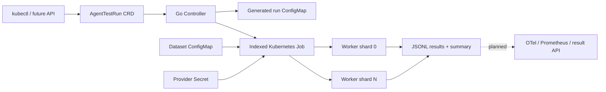

# AgentStorm

AgentStorm is a Kubernetes-native platform for load testing, evaluating, and observing AI
Agent workloads. It turns an `AgentTestRun` custom resource into indexed Kubernetes Jobs,
runs a JSONL scenario set with bounded concurrency, and evaluates deterministic quality and
latency thresholds.

> Status: early alpha. The local worker and the first controller reconciliation path are
> implemented. Central result ingestion, OpenTelemetry export, fault injection, and autoscaling
> are planned milestones rather than finished features.

## Why this project

Most Agent demos optimize for a single successful conversation. AgentStorm focuses on the
engineering questions that appear after a workflow becomes a service:

- Does quality regress when the prompt, model, tool, or workflow version changes?
- What happens under concurrent load, rate limiting, timeouts, and tool failures?
- Can a run be scheduled, cancelled, retried, observed, and cleaned up declaratively?
- Can test evidence be compared without treating an LLM judge as the only source of truth?

## Current capabilities

- `AgentTestRun` CRD with lifecycle status and declarative cancellation.
- CEL-enforced immutable execution fields so one run cannot mix configuration versions.
- Go controller built with controller-runtime.
- Indexed Kubernetes Job execution with per-pod dataset sharding.
- Dataset readiness checks and Secret-based API key injection.
- Python worker with bounded asynchronous concurrency.
- No-cost deterministic `fake` provider and optional OpenAI Agents SDK adapter.
- JSONL case results plus success rate, error rate, token counters, and P95 latency summary.
- Threshold-based process exit codes suitable for CI and Kubernetes Job status.

## Architecture



The controller never serializes API keys into generated ConfigMaps. Provider credentials are
injected directly from a Kubernetes Secret into worker pods.

## Local quickstart

The fake provider uses only the Python standard library.

```bash
make worker-local
```

Results are written to:

```text
.out/local/results.jsonl
.out/local/summary.json
```

Run all tests:

```bash
make test
```

Build the controller:

```bash
make build
```

## Kubernetes quickstart

Prerequisites: `kubectl`, Docker, and an existing kind cluster with Indexed Jobs and CRD CEL
validation enabled. Replace `kind` below if the cluster has a different name.

```bash
make docker-build
kind load docker-image agentstorm-controller:dev agentstorm-worker:dev --name kind
kubectl apply -k config/default
kubectl apply -f config/samples/agentstorm_v1alpha1_agenttestrun.yaml
kubectl get agenttestruns -w
```

This is a manual alpha workflow. A reproducible cluster bootstrap and published immutable images are
part of M1 in the development plan.

## `AgentTestRun` example

```yaml
apiVersion: agentstorm.io/v1alpha1
kind: AgentTestRun
metadata:
  name: smoke
spec:
  target:
    provider: fake
  workload:
    datasetRef:
      name: agentstorm-demo-dataset
      key: cases.jsonl
    parallelism: 2
    concurrencyPerWorker: 4
    iterations: 1
    timeoutSeconds: 300
  evaluation:
    minSuccessRate: 1
    maxErrorRate: 0
    maxP95LatencyMs: 1000
  runner:
    image: agentstorm-worker:dev
    imagePullPolicy: Never
```

Set `spec.cancel: true` to request cancellation. Worker Jobs use `backoffLimit: 0` by default so
an expensive Agent case is not silently replayed after a pod failure.

An `AgentTestRun` is a one-shot execution record. Its target, workload, evaluation, and runner
fields are immutable after creation; create another resource to run a changed configuration.

## Repository layout

```text
api/v1alpha1/       Kubernetes API types
cmd/controller/     controller-manager entrypoint
internal/controller reconciliation and Job construction
config/             CRD, RBAC, deployment, and samples
worker/             Python Agent execution worker
examples/           local run configuration and datasets
docs/               architecture, roadmap, and reference designs
```

## Development roadmap

1. Persist and compare run results through an authenticated result API.
2. Export Agent, model, and tool-call telemetry with OpenTelemetry conventions.
3. Add reusable assertions, provider adapters, and controlled fault injection.
4. Add KEDA-based queue scaling and resource-aware scheduling.
5. Publish Helm charts, reproducible benchmarks, and a public demo.

See [development plan](docs/development-plan.md), [architecture](docs/architecture.md), and
[reference designs](docs/reference-designs.md) for the decision-complete design.

## License

MIT
